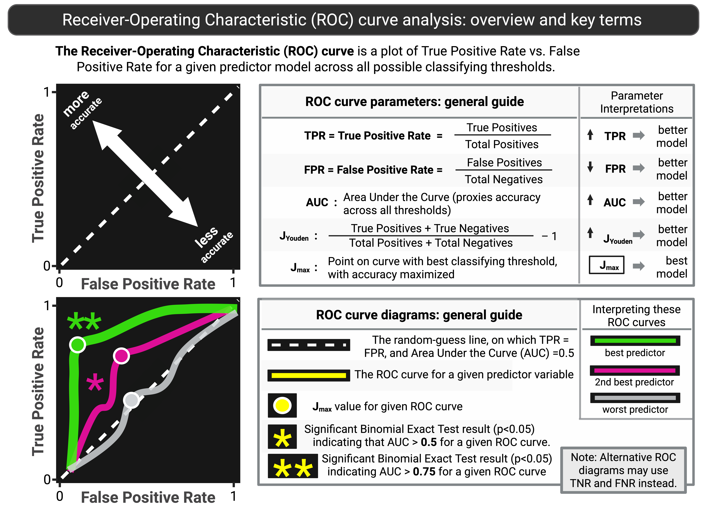
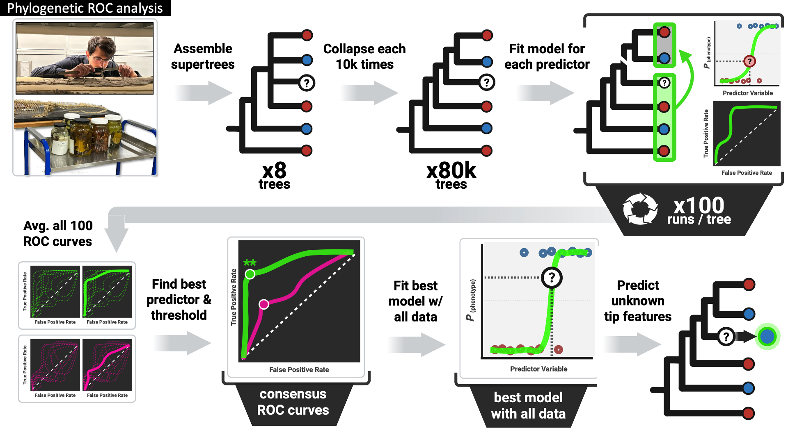
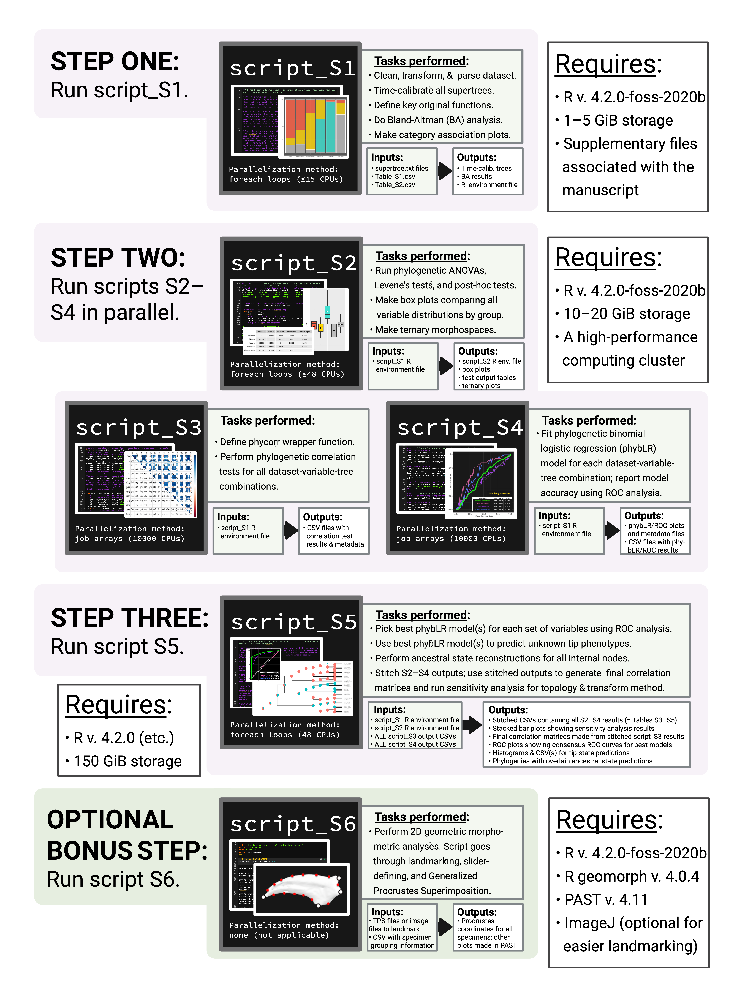

# limb-proportions-aquatic-amniotes-2025
Code and data for “Limb proportions predict aquatic habits and soft-tissue flippers in extinct amniotes” (Current Biology, 2025)

This repository contains all the code (R scripts, Bash scripts, etc.) and raw linear morphometric and ecological data associated with the manuscript "Limb proportions predict aquatic habits and soft-tissue flippers in extinct amniotes" (Current Biology 35: 1–17, [DOI: 10.1016/j.cub.2025.10.068](https://doi.org/10.1016/j.cub.2025.10.068)). For any questions about this repo or the associated analysis, please feel free to contact me via email at c.gordon@yale.edu or calebgordon@ufl.edu.

## Project Abstract

     
For this paper, we used a phylogenetic supervised machine-learning approach on a large original comparative dataset of limb measurements to reconstruct the evolutionary history of aquatic lifestyles and soft-tissue flippers in several extinct groups of mammals and reptiles. We ultimately found that simple limb region proportions ( Lacropodium / Lzeugopodium ) could predict the presence of soft-tissue flippers and highly/fully aquatic habits with >90% accuracy across amniotes. Our predictions suggest that mesosaurs and other Paleozoic reptiles did not evolve highly/fully aquatic habits, and that the major clades of Mesozoic marine reptiles followed lineage-specific patterns of aquatic adaptation. More broadly, we find that phylogenetic ROC analysis can reconstruct cryptic phenotypes with high accuracies in extinct species and effectively makes predictions on phylogenetically structured data.

Shown right is a graphical abstract of the paper, made on BioRender.com. We give full image attributions for PhyloPic taxon silhouettes, BioRender graphics, and other image sources used throughout the README in the "Extended Acknowledgments and Image Attributions" section of the [Extended Supplementary Text](https://figshare.com/articles/online_resource/Extended_Supplementary_Information_Data_Tables_and_R_Scripts_for_the_following_paper_Gordon_C_M_Freisem_L_S_Griffin_C_T_Gauthier_J_A_Bhullar_B_-A_S_2025_Limb_proportions_predict_aquatic_habits_and_soft-tissue_flippers_in_extinct_amniotes_i_/30395887?file=58893988). You can find this and other supplementary information within the associated Figshare repository, linked below.

## Repo Introduction
We set up this repository to make it easier for other researchers to repeat our analyses. If you'd like to repeat our analyses, we recommend you start by reading [the original publication](https://doi.org/10.1016/j.cub.2025.10.068) on Current Biology and accessing the [Extended Supplementary Material](https://doi.org/10.6084/m9.figshare.30395887) on Figshare. The Extended Supplementary Material includes all large data files for the project, in addition to copies of all the code and raw data stored in this repo. After that, we'd recommend following along with this README file, which will go broadly over the workflow for the project and provide some guidance on how to repeat its analyses. The text in in this README, and the code in this repo, are all repurposed from those original sources, which are cited below.

## Citing this Repo
When using any of the code or data in this repository, please cite the following sources:

Original paper:
> Caleb M. Gordon, Lisa S. Freisem, Christopher T. Griffin, Jacques A. Gauthier, Bhart-Anjan S. Bhullar. (2025). Limb proportions predict aquatic habits and soft-tissue flippers in extinct amniotes. Current Biology 35: 1–17. [https://doi.org/10.1016/j.cub.2025.10.068](https://doi.org/10.1016/j.cub.2025.10.068).

Extended Supplementary Material:
> Caleb M. Gordon, Lisa S. Freisem, Christopher T. Griffin, Jacques A. Gauthier, Bhart-Anjan S. Bhullar. (2025). Extended Supplementary Information, Data Tables, and R Scripts for Gordon et al. 2025: ‘‘Limb proportions predict aquatic habits and soft-tissue flippers in extinct amniotes’’ Figshare. [https://doi.org/10.6084/m9.figshare.30395887](https://doi.org/10.6084/m9.figshare.30395887).

## Project Motivation
Mammals ( 🦘 🐀 🦍 ) and reptiles ( 🦎 🐢 🐊 🦅 ) are ancestrally land-dwelling or terrestrial ( ⛰️ ) animals. And yet, over the last 300 million years, dozens of mammal and reptile lineages have independently adapted to life in the water ( 🌊 ). The most aquatically specialized of these groups have limb  💪  morphologies that suggest a fully marine lifestyle, but their transitional, semi-aquatic ancestors have more ambiguous morphologies, making it difficult to determine which fossil species were aquatic and resolve precisely how aquatic they were. Predicted soft-tissue limb features, such as webbed hands/feet and flippers, offer promise to help discern the semi-aquatic habits of extinct species, and various morphometric 📐 and osteological 🦴 features have been linked to aquatic habits, interdigital webbing, or flippers over the years, but none of these purportedly predictive features have been validated using phylogenetic comparative methods——that is, in a way that takes into account how these animals are all related to one another.

Validating these purportedly predictive features is a challenge, because it's often unclear where many of these groups go on the amniote family tree 👪 🪾 and how their constituent subclades are related. 

In addition, for several extinct clades with disputed aquatic habits, different lines of evidence have suggested conflicting  ⚔️  interpretations of their aquatic habits, leaving us with no objective means for favoring one line of evidence (one predictive feature) over another when they disagree.

For this project, we developed an approach that could deal with these phylogenetic 🪾 uncertainties, validate ✅ various previously proposed morphometric predictors of aquatic habits and flippers, select the best 🏆 of multiple conflicting predictors for these features when they disagree, and use these best predictors to figure out 🔮 exactly which extinct species in each of these groups had highly/fully aquatic habits and flippers.

## Overview of Approach

#### 1. <u>We measured modern and extinct tetrapod limbs</u>.
- We generated a morphometric dataset of 11,410 original linear measurements on n = 747 tetrapod specimens and 5,611 landmarks placed on n = 256 tetrapod specimens. 
- We measured specimens either in person with calipers or digitally from 2D or 3D images.

#### 2. <u>We scored specimens with known aquatic habits and soft-tissue phenotypes</u>.
- We devised a scoring system for aquatic habits and soft-tissue limb phenotypes that could be applied consistently across amniotes.
- Using this system, we assigned aquatic affinity scores and soft-tissue limb phenotypes to all taxa in our dataset for which these values could be determined prior to analysis (e.g., by direct observation or from the literature).

#### 3. <u>We used these data to train models that could predict similar phenotypes in extinct taxa</u>.
- We compared measurements across aquatic affinity and limb phenotype bins, and trained logistic regression models to predict them.
- We compared the accuracies of these models using __ROC analysis__, and used the best models to make predictions in extinct species.

## Phylogenetic ROC Analysis
We used measurements for specimens with known phenotypes to train and test __phylogenetic binomial logistic regression__ models. We then compared the predictive accuracies of these models for each morphometric feature across the whole dataset and for individual clades within our dataset using __Receiver-Operating Characteristic (ROC)__ curve analysis——a collection of methods that was originally developed by the U.S. Army Signal Corps in World War II. We provide more information about ROC analysis in the STAR Methods of [our original paper](https://doi.org/10.1016/j.cub.2025.10.068). For a quick and excellent overview of this method, we highly recommend checking out [Tom Fawcett's 2006 introduction to ROC analysis](https://www.sciencedirect.com/science/article/abs/pii/S016786550500303X?via%3Dihub). 

ROC analysis is just a way to richly compare the predictive performance of multiple machine-learning models in different contexts and pick their best predicted probability thesholds for assigning classifications.

It centers around the __ROC curve__—a plot of __true positive rate (TPR)__ vs. __false positive rate (FPR)__ values for a particular predictive model whose coordinates differ depending on the predicted probability threshold for classifying a binary response variable.

You can compare the predictive accuracies of two or more machine-learning models across all possible classification thresholds using the __Area Under the Curve (AUC)__, which can range between 0 and 1.

Each ROC curve represents a single predictive model, and each point on the curve represents a different classification threshold:

<video autoplay loop muted playsinline width="750" controls style="border: 5px solid #555;">
  <source src="[https://github.com/user-attachments/assets/3e2c3094-a98d-4eff-8213-ac0e66840338](https://github.com/user-attachments/assets/3e2c3094-a98d-4eff-8213-ac0e66840338)" type="video/mp4">
</video>

Here's a [link](https://github.com/Caleb-M-Gordon/limb-proportions-aquatic-amniotes-2025/blob/main/explanatory_images/ROC_animation.mp4) to the video above relating logistic regression and ROC curves, in case it doesn't appear inline in the README.

<a href="explanatory_images/ROC_animation.mp4">Open the video</a>

#### Dealing with Phylogenetic Uncertainty 👪 🪾

As we described above, there's a lot of debate about how various groups of mammals and reptiles are related to one another. To perform phylogenetic comparative tests that could account for this uncertainty, we assembled 8 alternative maximally agnostic __supertrees__ relating all sampled species. These supertrees considered 3 pairs of competing phylogenetic hypotheses about how the various groups of amniotes in the dataset were related to one another. During each run of our analysis (whenever we trained a predictive model), we spontaneously collapsed each of these trees 10,000 times to remove polytomies and make the tree fully dichotomous, and repeated the model-training process once for each of these collapsed trees, so that we repeated the fitting procedure 10k times per run.

#### Fitting Phylogenetic ROC Curves 🪾📈
 
For each predictive feature, we randomly split the tree into thirds, using 2/3 to fit a phylogenetic logistic regression model and the remaining 1/3 to test it. We then plotted an ROC curve to assess the accuracy of the regression model, and repeated this process 100x to account for run-specific biases in taxonomic sampling.

We then averaged all 100 resulting ROC curves to get a single separate __consensus ROC curve (cROCC)__ for each morphometric feature, which we compared these consensus curves in ROC space to select the best predictor and classifying threshold.

Once a final 'best' model was selected, we fit this model with all the data, and used the resulting best predictor-threshold pair to predict the previously disputed aquatic affinities and soft-tissue phenotypes of extinct species.

This approach could be repeated for any region of treespace (e.g., any individual clade within the dataset), enabling a clade-specific comparison of the predictive accuracies of different morphometric predictor variables for aquatic habits and soft-tissue phenotypes. More information about this approach is provided in in the STAR Methods of [the original paper](https://doi.org/10.1016/j.cub.2025.10.068).

## Data Analysis Pipeline

We implemented the approach described above in R (v. 4.2.0-foss-2020b) on the Grace High-Performance Computing Cluster at Yale University, using varying degrees of parallelization to accelerate computation. This section of the README contains a description of all script and data files that are included in the repository and required to rerun our analysis. The R scripts below are annotated to guide researchers through the steps of the analysis, and a diagram at the bottom of this README describes how they fit into the broader data analysis pipeline we used in this study.

#### <u>We used the following six R scripts to run all of our data analyses</u>:
- [__script_S1.R__](R_scripts/script_S1.R): This script begins the analysis by processing the dataset, calibrating all supertrees, completing a few computationally inexpensive analyses, and defining original functions and R-objects required for downstream scripts.
  
- [__script_S2.R__](R_scripts/script_S2.R): This script performs all phylogenetic ANOVAs, Levene’s tests, and post-hoc tests, and generates associated box plots and ternary plots referenced in the paper.
  
- [__script_S3.R__](R_scripts/script_S3.R): This script performs all the phylogenetic-correlation tests reported here.
  
- [__script_S4.R__](R_scripts/script_S4.R): This script fits all the phylogenetic binomial-logistic-regression models referenced in the paper.
  
- [__script_S5.R__](R_scripts/script_S5.R): This script stitches together the outputs from previous scripts, uses ROC analysis to select the best-performing models and classification thresholds from script S4, and uses those selected model-threshold pairs and ancestral-state estimations to reconstruct the tip- and internal-node phenotypes for all extinct taxa in the dataset. This script also includes a sensitivity analysis to assess the impact of differing tree topologies and data-transformation methods on our results.
  
- [__script_S6.Rmd__](R_scripts/script_S6.Rmd): This script contains all of the R code required to perform the geometric morphometric analyses associated with this study.

#### <u>These R scripts work in tandem with the following bash scripts and job arrays</u>:
- [__BASH_script_S1.sh__](bash_scripts/_BASH_script_S1.sh): This bash script runs R script_S1 on a high-performance computing cluster. 
- [__BASH_script_S2.sh__](bash_scripts/_BASH_script_S2.sh): This bash script runs R script_S2 on a high-performance computing cluster.
- [__BASH_script_S3.sh__](bash_scripts/_BASH_script_S3.sh): This bash script runs R script_S3 on the associated job array as a batch job on a high-performance computing cluster.
- [__BASH_script_S4.sh__](bash_scripts/_BASH_script_S4.sh): This bash script runs R script_S4 on the associated job array as a batch job on a high-performance computing cluster.
- [__script_S3_joblist.txt__](job_arrays/script_S3_joblist.txt): This plain-text file contains the job array specified in BASH_script_S3.
- [__script_S4_joblist.txt__](job_arrays/script_S4_joblist.txt): This plain-text file contains the job array specified in BASH_script_S4.

#### <u>These scripts make use of the following input data</u>:
- Input tree files (plain-text files in Newick format, representing alternative tree topologies for Pan-Reptilia):
  - [__supertree1.txt__](input_data/input_trees/Newick_files/supertree1.txt): Tree assuming Hanosaurus at base of Sauropterygiformes, monophyletic Parareptilia at base of Pan-Reptilia, and molecular topology of Squamata
  - [__supertree2.txt__](input_data/input_trees/Newick_files/supertree2.txt): Tree assuming Hanosaurus at base of Sauropterygiformes, Captorhinidae at base of Pan-Reptilia, and molecular topology of Squamata
  - [__supertree3.txt__](input_data/input_trees/Newick_files/supertree3.txt): Tree assuming Hanosaurus at base of Sauropterygiformes, monophyletic Parareptilia at base of Pan-Reptilia, and morphological topology of Squamata
  - [__supertree4.txt__](input_data/input_trees/Newick_files/supertree4.txt): Tree assuming Hanosaurus at base of Sauropterygiformes, Captorhinidae at base of Pan-Reptilia, and morphological topology of Squamata
  - [__supertree5.txt__](input_data/input_trees/Newick_files/supertree5.txt): Tree assuming monophyletic Saurosphargidae at base of Sauropterygiformes, monophyletic Parareptilia at base of Pan-Reptilia, and molecular topology of Squamata
  - [__supertree6.txt__](input_data/input_trees/Newick_files/supertree6.txt): Tree assuming monophyletic Saurosphargidae at base of Sauropterygiformes, Captorhinidae at base of Pan-Reptilia, and molecular topology of Squamata
  - [__supertree7.txt__](input_data/input_trees/Newick_files/supertree7.txt): Tree assuming monophyletic Saurosphargidae at base of Sauropterygiformes, monophyletic Parareptilia at base of Pan-Reptilia, and morphological topology of Squamata
  - [__supertree8.txt__](input_data/input_trees/Newick_files/supertree8.txt): Tree assuming monophyletic Saurosphargidae at base of Sauropterygiformes, Captorhinidae at base of Pan-Reptilia, and morphological topology of Squamata

- Input data tables required to begin the analysis:
  - [__Table_S01.csv__](input_data/Table_S01.csv): All linear-morphometric, limb-phenotype, and aquatic-affinity data
  - [__Table_S02.csv__](input_data/Table_S02.csv): All repeat length measurements and ratios for Bland-Altman analysis
  
- Input data tables generated during and used downstream in the analysis:
  - [__Table_S03.csv__](input_data/Table_S03.csv): The stitched results from all phylogenetic ANOVAs, Levene’s, and post-hoc tests (performed in script_S2)
  - [__Table_S04.csv__](input_data/Table_S04.csv): The stitched results from all phylogenetic-correlation tests (performed in script_S3)
  - [__Table_S05.csv__](input_data/Table_S05.csv): The stitched results from all phylogenetic binomial-logistic-regression analyses (performed in script_S4)
  - [__Table_S06.csv__](input_data/Table_S06.csv): The combined and processed phylogenetic comparative-test metadata for our sensitivity analyses (performed in script S5)
  - [__Table_S07.csv__](input_data/Table_S07.csv): All tip-phenotype predictions made by our best phylogenetic binomial logistic regression models (run in script S5)
  - [__Table_S08.csv__](input_data/Table_S08.csv): All internal-node phenotypes inferred from the tip states in Table_S07 (computed in script_S5)
  - [__Table_S09.csv__](input_data/Table_S09.csv): A summary of the geometric-morphometric data generated in script_S6

- Input data required for geometric morphometric (GM) analysis:
  - [__input_files_for_GM__](input_data/input_files_for_GM): Folder containing all the raw landmark coordinates, Procrustes coordinates, and curveslide files for the three geometric morphometric analyses performed in R script_S6

#### To repeat this analysis, please follow the steps illustrated below. 

